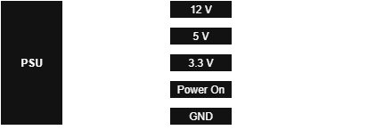
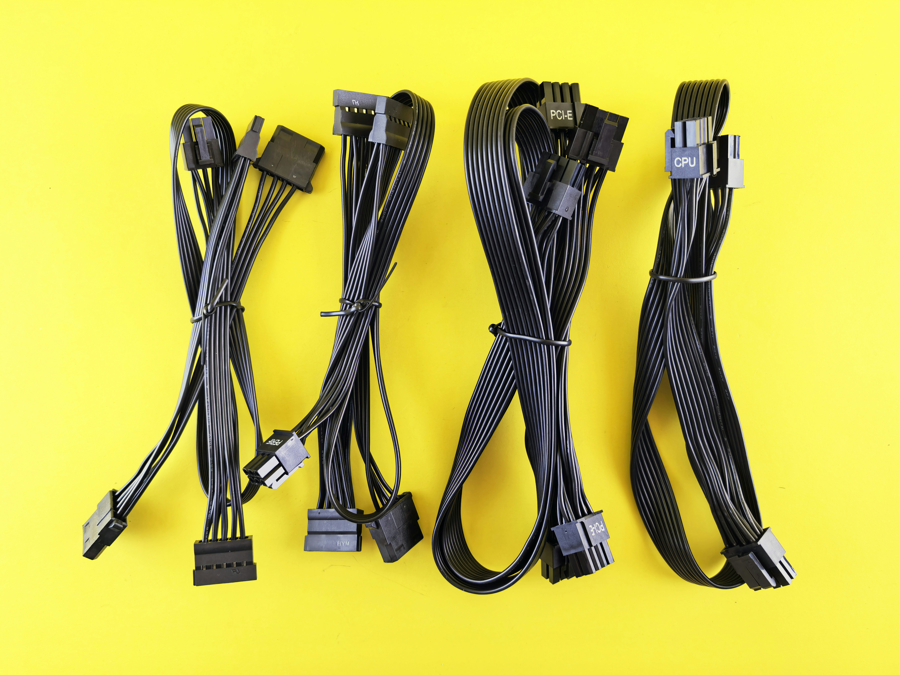

# PSU - Power Supply Unit
PSUs come in many different shapes and sizes, but they do have standards, and the basic layout of all PSUs follow this general rule of thumb.

The reason being (depending on where you are in the world) The wall outlet near you outputs a Alternating Current or **AC** power source, and the PSU transforms this into a Direct Current **DC** power source that can be used by the computer. And every componenent in a computer needs it own way of getting power, hence when you look at a typical PSU, there are a bunch of cables and connectors coming out of it.

The exact wires and voltages that are on them are all different, so it is super important that you if you attempt any kind of PSU or PSU Cable modding that you create diagrams or schematics to keep track of everything.

*Pro-tip : If you can, get a old but working PSU and just get used to figuring out how to use a multimeter on it, and takes notes like I did here*

And Since theare 

[PSU Form Factors](types_of_psus.md)