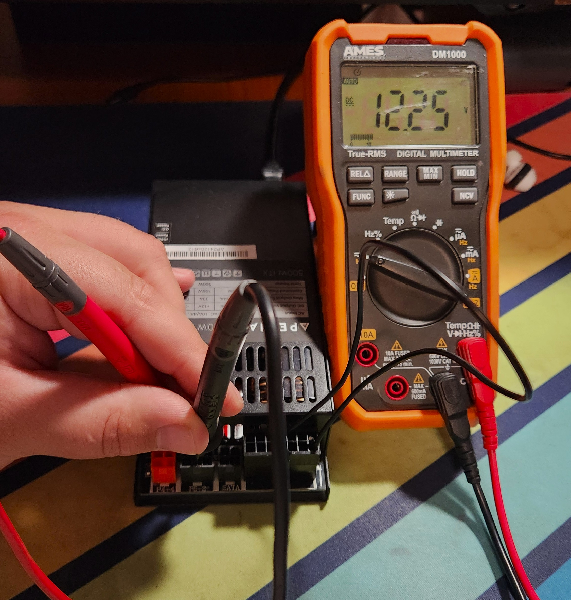
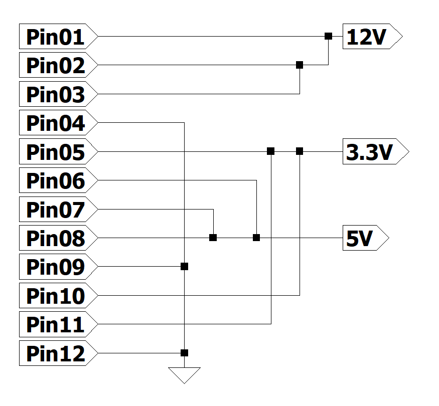
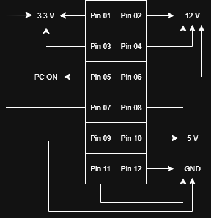

# PSU - Power Supply Unit
PSUs come in many different shapes and sizes, but they do have standards, and the basic layout of all PSUs follow this general rule of thumb.

The reason being that the wall outlet that you may or may not use outputs a Alternating Current or **AC** power source, and the PSU transforms this into a Direct Current **DC** power source that can be used by the computer. And every componenent in the computer needs its own way of getting power, hence when you look at a typical PSU, there are a bunch of cables and connectors coming out of it.

The exact voltages on these wire are all different, so it is super important that you if you attempt any kind of PSU or PSU Cable modding that you create diagrams or schematics to keep track of everything.

*Pro-tip : If you can, get a old but working PSU and just get used to figuring out how to use a multimeter on it, and takes notes like I did here*

There is a multitude of different forms of PSUs, and getting to know the ones you use will be important if you want to do some modifications to it. Some helpful software to use would be [draw.io](https://app.diagrams.net/) that is great for simple diagrams, or if you aspire to be/are an electrical guy [LTspice](https://www.analog.com/en/resources/design-tools-and-calculators/ltspice-simulator.html) is a great tool for making circuit diagrams. And good pen and paper works just as well if not better.

*LTspice Example*

    
*draw.io Example*

For more [PSU Form Factors](types_of_psus.md) info, click on the link