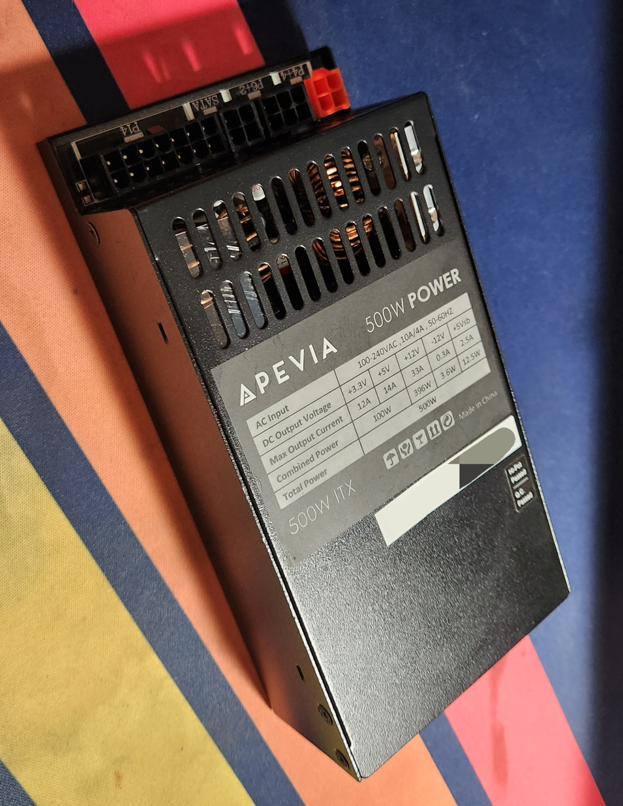
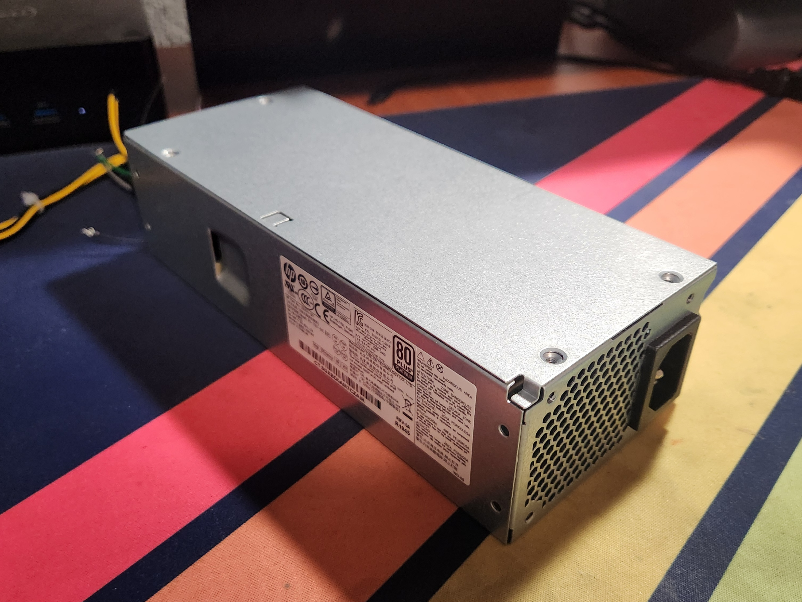

# Form Factors
*This page will update as I get more access to other types of PSU and get more data on them*

How to read table
| Dimemsions | Use Cases |
|----|----|
| Width x Height x Depth | Some tidbit of information |
## ATX
Working on it
## Mini-ATX
Working on it
## SFX
Working on it
## Flex ATX
### Also known as "Mini-ITX"
    
The PSU shown here is from Apevia rated for 500W. But this form factor has some variations in lengths making it important to look at the product page before purchasing.

|Common Dimemsions|Use Cases|
|----------|---------|
|81.5mm x 40.5mm x 150mm| Small Form Factor Computers|

Unless you have a really small computer you are working with, and want the PSU to fit inside the case when your done, try another one. Just because the pinouts seem to be inconsist across the board for this form factor, and the amount of power you can push out it rather limited. But then again you have multimeter (*probably if your reading this guide*) so it doesn't really matter too much does it.
## Proprietary
### HP
    
This particular PSU came from a **HP Elitedesk 705 G5 SFF**, which outputs around 185W. This PSU is the reason that I making this guide in the first place.